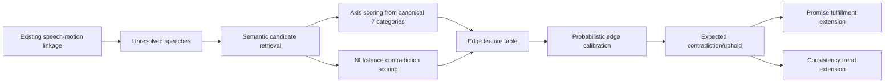

# Say-vs-Do Contradiction Stack: Implementation Specification

Status: Draft for implementation
Owner: manuscript-agent + analysis pipeline maintainers
Date: 2026-05-29

## 1. Goal

Implement a contradiction-aware "say vs do" layer for speeches that do not map cleanly to a single motion/vote, while preserving the existing deterministic and parquet-first workflow.

The solution combines all three alternatives into one production pipeline:

1. Semantic retrieval for unresolved speech-to-action links
2. Interpretable ideology-axis scoring (strictly based on the canonical seven categories)
3. Probabilistic edge fusion with uncertainty-aware contradiction/uphold metrics

The outputs must integrate with existing artifacts used by:

- `src/swedish_parliament_policy_classifier/analysis/promise_fulfillment.py`
- `scripts/analyze_consistency_trends.py`
- `scripts/analyze_recency_weighted_trends.py`
- `scripts/run_speech_analysis_suite.py`

## 2. Hard Constraints

1. Do not modify category semantics in `src/swedish_parliament_policy_classifier/definitions/political_spectrum.yaml`.
2. Category names/order must be loaded from `src/swedish_parliament_policy_classifier/definitions/loader.py` via `load_verified_definitions()`.
3. Parquet-first outputs under `output/analysis/` (zstd compression).
4. Preserve current metrics and outputs; add new fields/artifacts in parallel.
5. Thermal-safe defaults for new scripts (low cpu-fraction default, bounded candidate sets).

## 3. Canonical Ideology Axes (Alternative 2)

### 3.1 Axis Definition

Axes are exactly the seven categories:

1. `far_left`
2. `left`
3. `centre_left`
4. `centre`
5. `centre_right`
6. `right`
7. `far_right`

No additional ideology dimensions are allowed in v1.

### 3.2 Axis Vector Contract

For any text unit `t` (speech/action), compute an affinity vector:

- `axis_vector[t] = [p_far_left, ..., p_far_right]`
- `sum(axis_vector[t]) == 1.0` (within floating tolerance)
- Category order follows loader output order, persisted in metadata.

### 3.3 Swedish Bureaucratic-Political Term Layer

Add a term normalization helper (no ideology redefinition) for retrieval/stance context:

- `reglering`, `avreglering`
- `statlig styrning`, `kommunalt självstyre`, `huvudmannaskap`
- `likvärdighet`, `kvalitetssäkring`, `tillsyn`, `tillståndsplikt`
- `myndighetsutövning`, `detaljstyrning`, `ramstyrning`
- `friskolor`, `vinstuttag i välfärden`

This helper only improves text matching and stance extraction quality.

## 4. End-to-End Architecture

## 5. New Artifacts and Schemas

All files compressed with zstd parquet unless otherwise stated.

### 5.1 Candidate Edges

Path: `output/analysis/speech_action_candidates.parquet`

Columns:

- `speech_id` (str)
- `action_id` (str)
- `action_type` (enum: `motion`, `vote_context`, `betankande`, `proposition`)
- `party_speech` (str)
- `party_action` (str)
- `year_speech` (int)
- `year_action` (int)
- `days_diff` (int)
- `semantic_score` (float)
- `category_overlap` (float)
- `candidate_source` (enum: `id`, `betankande_bridge`, `semantic`, `time_party_category`)
- `rank_within_speech` (int)

### 5.2 Axis Scores

Path: `output/analysis/speech_action_axis_scores.parquet`

Columns:

- `speech_id` (str)
- `action_id` (str)
- `axis_order` (json list of category names)
- `speech_axis` (json list[float], len=7)
- `action_axis` (json list[float], len=7)
- `axis_js_distance` (float)
- `axis_cosine_distance` (float)
- `axis_peak_speech` (str)
- `axis_peak_action` (str)
- `axis_peak_flip` (bool)

### 5.3 Contradiction Edge Scores

Path: `output/analysis/speech_action_contradiction_edges.parquet`

Columns:

- `speech_id` (str)
- `action_id` (str)
- `nli_entail_prob` (float)
- `nli_neutral_prob` (float)
- `nli_contradict_prob` (float)
- `rule_conflict_flag` (bool)
- `contradiction_score_raw` (float)
- `edge_confidence_raw` (float)

### 5.4 Probabilistic Expected Metrics

Path: `output/analysis/speech_action_expected_contradiction_party_topic_year.parquet`

Columns:

- `party` (str)
- `topic` (str)
- `year` (int)
- `n_speeches` (int)
- `n_candidate_edges` (int)
- `expected_contradiction` (float in [0,1])
- `expected_uphold` (float in [0,1])
- `mean_edge_confidence` (float)
- `unlinked_rate_post_retrieval` (float)

## 6. Module and File Changes

## 6.1 New Modules

1. `src/swedish_parliament_policy_classifier/analysis/semantic_action_candidates.py`
- Input: existing speech classifications + action corpora
- Output: candidate edge table (`speech_action_candidates.parquet`)

2. `src/swedish_parliament_policy_classifier/analysis/ideology_axes.py`
- Load canonical categories from `definitions.loader`
- Compute normalized 7-axis vectors for speech/action texts

3. `src/swedish_parliament_policy_classifier/analysis/contradiction_scoring.py`
- NLI + rule-assisted contradiction scoring for each candidate edge

4. `src/swedish_parliament_policy_classifier/analysis/probabilistic_alignment.py`
- Calibrate edge confidence and compute expected contradiction/uphold per party/topic/year

## 6.2 Existing File Updates

1. `scripts/build_speech_motion_linkage.py`
- Add optional candidate-emission mode (`--emit-candidates`)
- Keep current best-link output unchanged

2. `src/swedish_parliament_policy_classifier/analysis/promise_fulfillment.py`
- Left-join expected contradiction table
- Add new party metrics:
  - `expected_contradiction`
  - `expected_uphold`
  - `ideology_uphold_v2`

3. `scripts/analyze_consistency_trends.py`
- Add contradiction-adjusted metrics:
  - `contradiction_adjusted_consistency`

4. `scripts/run_speech_analysis_suite.py`
- Orchestrate new steps via flags (see section 7)

## 7. CLI Specification

### 7.1 New Script

`scripts/score_say_vs_do_contradiction.py`

Arguments:

- `--speech-classifications` (default existing parquet)
- `--speech-parquet-dir` (default existing dir)
- `--analysis-out` (default `output/analysis`)
- `--max-candidates-per-speech` (default `5`)
- `--semantic-threshold` (default `0.55`)
- `--max-days` (default `365`)
- `--cpu-fraction` (default `0.25`)
- `--use-nli` (flag)
- `--model-name` (semantic model)
- `--mlflow` (flag)

### 7.2 Orchestrator Flags

Add to `scripts/run_speech_analysis_suite.py`:

- `--run-contradiction`
- `--contradiction-max-candidates`
- `--contradiction-semantic-threshold`

Execution order in suite:

1. Existing gap + promise
2. Contradiction scoring
3. Consistency trends (reading contradiction outputs if present)
4. Recency/SARIMAX

## 8. Metric Definitions

### 8.1 Edge-Level

- `contradiction_score_raw = w1*nli_contradict_prob + w2*axis_js_distance + w3*rule_conflict_flag`
- `edge_confidence_raw = sigmoid(z(edge_features))` from calibration model

Initial defaults (v1):

- `w1=0.6`, `w2=0.3`, `w3=0.1`

### 8.2 Party/Topic/Year Expected Metrics

For each speech, normalize candidate edge confidences to sum to 1.

Then:

- `expected_contradiction = mean(sum(p_edge * contradiction_edge))`
- `expected_uphold = 1 - expected_contradiction`

### 8.3 Consistency Extension

Keep existing score and add:

- `ideology_uphold_v2 = consistency_score * pct_speech_motion_vote * (1 - expected_contradiction)`

## 9. Validation and Test Plan

## 9.1 Unit Tests

Add tests under `tests/`:

1. `test_ideology_axes_loader_contract.py`
- Verifies category order and strict YAML loader usage.

2. `test_axis_vector_normalization.py`
- Ensures vectors sum to 1 and length is 7.

3. `test_semantic_candidate_generation.py`
- Ensures top-K and thresholds behave as expected.

4. `test_contradiction_score_computation.py`
- Deterministic edge score from controlled fixtures.

5. `test_probabilistic_alignment_expectation.py`
- Expected contradiction aggregation correctness.

## 9.2 Integration Tests

1. `test_say_vs_do_contradiction_pipeline_smoke.py`
- Runs new script on small fixture and checks parquet outputs.

2. Extend `test_speech_motion_linkage.py`
- Ensure candidate mode does not break existing linkage output.

3. Extend consistency/promise tests
- Ensure new columns appear and old columns remain unchanged.

## 9.3 Acceptance Criteria

1. Existing pipeline outputs are byte-schema compatible (additive changes only).
2. New contradiction outputs generated on full corpus without failure.
3. No mutation of canonical ideology definition file.
4. `uv run pytest -q` passes including new tests.

## 10. Performance and Thermal Safety

1. Defaults: `cpu-fraction=0.25`, `max-candidates-per-speech=5`.
2. Batch semantic encoding.
3. Cache action embeddings across run.
4. Optional `--limit` for smoke and CI.

## 11. Rollout Plan

Phase 1 (Foundations):

1. Implement axis module with loader-backed categories.
2. Add candidate emission parquet.

Phase 2 (Edge Scoring):

1. Add contradiction scoring module.
2. Add expected contradiction aggregation module.

Phase 3 (Integration):

1. Merge into promise fulfillment and consistency scripts.
2. Add orchestrator flags.

Phase 4 (Reporting):

1. Add figure/table exports using contradiction metrics.
2. Update manuscript sections with provenance and n counts.

## 12. Risks and Mitigations

1. Risk: semantic false links.
- Mitigation: confidence calibration + top-K cap + time/party filters.

2. Risk: NLI mismatch for Swedish parliamentary language.
- Mitigation: rule-feature blend and manual error bucket review.

3. Risk: metric instability across years.
- Mitigation: report confidence intervals/coverage, keep v1 metrics in parallel.

## 13. Deliverables Checklist

1. New analysis modules (4 files)
2. New driver script (`scripts/score_say_vs_do_contradiction.py`)
3. Updated orchestrator and downstream analyses
4. New parquet artifacts in `output/analysis/`
5. Tests + CI green
6. Manuscript-ready summary artifacts and provenance logs
